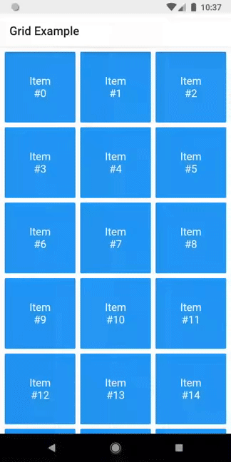
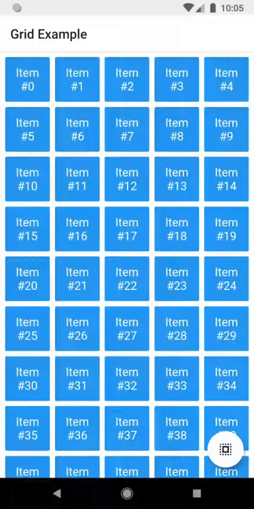

# drag_select_grid_view  
  
[](https://pub.dartlang.org/packages/drag_select_grid_view)  
  
A grid that supports both dragging and tapping to select its items.  


  
## Basic usage  
  
First of all, `DragSelectGridView` constructor is very similar to [`GridView.builder`](https://api.flutter.dev/flutter/widgets/GridView/GridView.builder.html), so you should take your time to understand the latter before diving into this library. 

Once you are familiar with [`GridView.builder`](https://api.flutter.dev/flutter/widgets/GridView/GridView.builder.html), probably the only additional piece of information you'll need is `DragSelectGridViewController`. With it, you're able to know which indexes are selected.

Check this example:

```dart
class MyApp extends StatefulWidget {
  @override
  _MyAppState createState() => _MyAppState();
}

class _MyAppState extends State<MyApp> {
  final controller = DragSelectGridViewController();

  @override
  void initState() {
    super.initState();
    controller.addListener(scheduleRebuild);
  }

  @override
  void dispose() {
    controller.removeListener(scheduleRebuild);
    super.dispose();
  }

  @override
  Widget build(BuildContext context) {
    return Scaffold(
      appBar: SelectionAppBar(
        selection: controller.selection,
      ),
      body: DragSelectGridView(
        gridController: controller,
        itemCount: 20,
        itemBuilder: (context, index, selected) {
          return SelectableItem(
            index: index,
            selected: selected,
          );
        },
        gridDelegate: SliverGridDelegateWithMaxCrossAxisExtent(
          maxCrossAxisExtent: 80,
        ),
      ),
    );
  }

  void scheduleRebuild() => setState(() {});
}
```

As you may have noticed in the code above, `DragSelectGridView` must be used along two other widgets in order to provide a proper user experience. In the example, they are: 

  * `SelectableItem`: A selectable widget, which is going to visually indicate whether the item is selected or not.
    
  * `SelectionAppBar`: A custom `AppBar`, which is able able to show the amount of selected items and an option to unselect them.
      
The [example project](https://github.com/hugocbpassos/drag_select_grid_view/tree/master/example/lib) provides some samples of those widgets. I won't add them to the library, since they are unrelated to the grid itself, but feel free to copy them into your project. 

## Advanced usage
 
You can use the setter `DragSelectGridViewController.selection` to directly change the selection (I'm not quite sure why you'd need this, but I don't ask questions). 

It allows this sort of interaction:



You can check the code [here](https://github.com/hugocbpassos/drag_select_grid_view/blob/master/example/lib/example_with_fab.dart).

There are some other minor settings you can do to make `DragSelectGridView` fit your needs, like `DragSelectGridView.autoScrollHotspotHeight` and `DragSelectGridView.unselectOnWillPop`. Those features are well documented, so I'll let you take your discovery time.

Hopefully, this is everything you need to know to use this library. 
  
## Thanks ❤️  
  
Once upon a time I asked at [Flutter Study Group](https://flutterstudygroup.com/) how to implement a specific feature that I intended to add to this library. [Simon Lightfoot](https://github.com/slightfoot) offered to help me and effortlessly implemented what eventually became part of this library ([check this gist](https://gist.github.com/slightfoot/a002dd1e031f5f012f810c6d5da14a11)). A big thanks to him.  
  
I took a lot of inspiration from [Aidan Follestad](https://github.com/afollestad)'s Android implementation, [drag-select-recyclerview](https://github.com/afollestad/drag-select-recyclerview). Also a big thanks to him.
